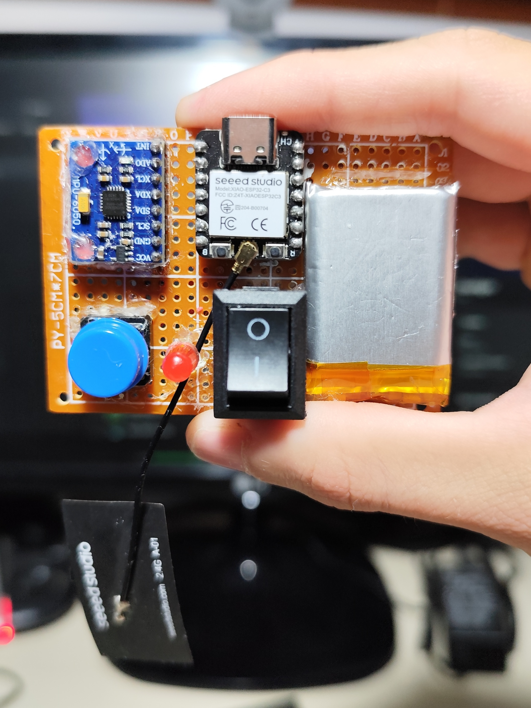
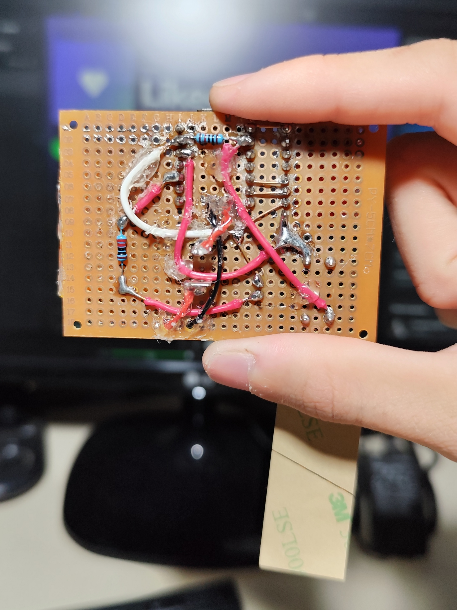
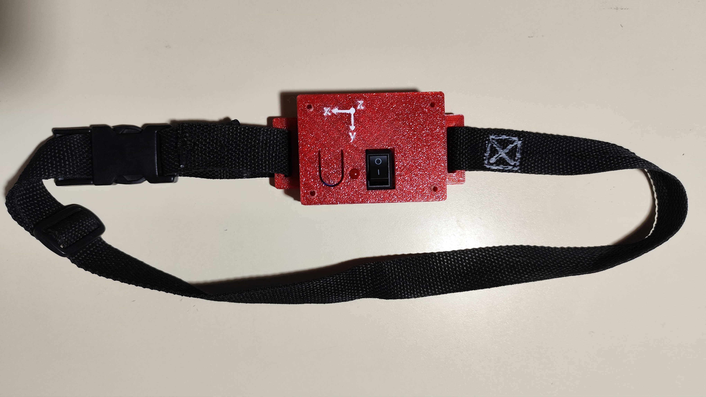
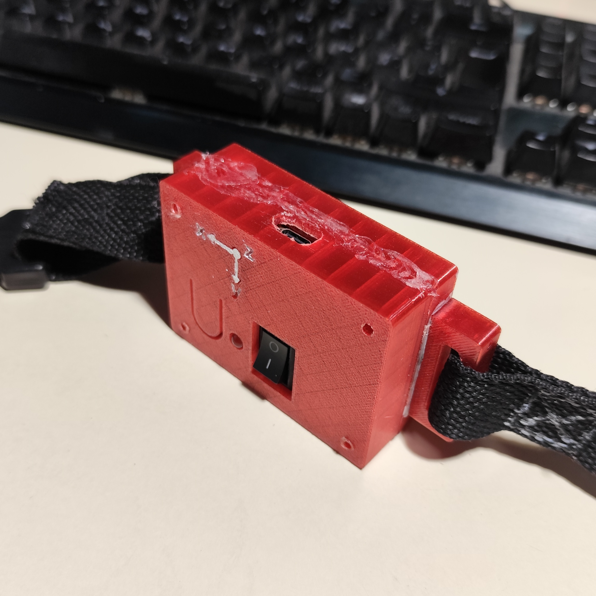

# Velocity-Based Training (VBT) System

A system to capture and analyze velocity data during strength-training exercises, enabling athletes and coaches to:

- Perform force–velocity curve analysis
- Estimate one-repetition maximum (1RM) via regression (the maximum intensity an athlete can lift for one repetition)
- Detect pre-workout fatigue by comparison with historical data
- Prescribe velocity zones for training sessions

The project was inspired by the chapter "Velocity in the Weight Room" from the book [Science and Practice of Strength Training (3rd edition)](https://us.humankinetics.com/products/science-and-practice-of-strength-training-3rd-edition-epub?_pos=2&_sid=e4ce0c3cd&_ss=r) by Zatsiorsky, Kraemer, and Fry.

## Table of contents

- [Overview](#overview)
- [Device](#device)
  - [Hardware](#hardware)
  - [Firmware](#firmware)
  - [Testing](#testing)
- [Signal Processing](#signal-processing)
- [Mobile App](#mobile-app)
- [Tasks & Roadmap](#tasks--roadmap)

## Overview

The system includes:

- A wearable inertial measurement unit (IMU) that captures and processes motion data during strength-training exercises
- A companion mobile app that receives results wirelessly, computes summary metrics, and displays them

See the [C4 Context Diagram](docs/diagrams/c4/context.svg) and [C4 Container Diagram](docs/diagrams/c4/container.svg) for architecture overviews.

Main technologies used:

- **Device Hardware**: [XIAO ESP32 C3](https://wiki.seeedstudio.com/XIAO_ESP32C3_Getting_Started/), [MPU6050](https://www.invensense.com/products/motion-tracking/6-axis/mpu-6050/)
- **Device Firmware**: PlatformIO with [Espressif IoT Development Framework (ESP-IDF)](https://www.espressif.com/en/products/sdks/esp-idf), [FreeRTOS](https://www.freertos.org/Why-FreeRTOS/What-is-FreeRTOS), NimBLE (Bluetooth Low Energy stack), C++20
- **Signal Processing**: Python, [NumPy](https://numpy.org/), [SciPy](https://scipy.org/), [Matplotlib](https://matplotlib.org/)
- **Mobile App**: TBD (likely TypeScript + React Native)

Key decisions and their rationale are documented in [Architecture Decision Records (ADRs)](docs/adrs/).

## Device

### Hardware

The device is built primarily by hand using off-the-shelf components and a custom 3D-printed enclosure. See the [assembly instructions](docs/device/assembly/instructions.md) for details on how to build your own device. Other resources:

- [Schematic](docs/diagrams/schematics/it2(xiao-esp32-c3)/schematic.svg)
- [Bill of materials](docs/device/assembly/bom.md)
- [Tools](docs/device/assembly/tools.md)
- [Enclosure design](docs/device/enclosure/enclosure.scad) and [STL](docs/device/enclosure/enclosure.stl)

First prototype photos:






### Firmware

The architecture follows a pipes-and-filters style, as documented in [ADR-7](docs/adrs/7-architecture-style.md) and the [C4 Component Diagram](docs/diagrams/c4/component.svg).

See [setup.md](docs/setup.md) for instructions on setting up the development environment and flashing the device.

### Testing

The device is tested at multiple levels:

#### Unit

Most relevant classes (e.g. `MPU6050Sensor`, `BLE`) are tested in isolation on the host machine, using dependency injection and test seams to replace device dependencies (FreeRTOS, ESP-IDF, NimBLE, I2C, MPU). Test seams consist of:

- **Ports**: classes/C-interfaces that wrap device dependencies, exposing only the necessary functionality to the rest of the codebase and allowing implementations to be swapped.
- **Compatibility layers**: using macros, they define structs, types and constants used by the client code but missing on the host. In production, they import device headers directly.
- **Real adapters**: forward calls to the actual device dependencies.
- **Doubles**: fake implementations that use [Googletest](https://github.com/google/googletest) or [FFF](https://github.com/meekrosoft/fff) and allow forcing return values and verify interactions.
- **Runners**: transform indefinite and concurrent tasks that run in the device into a single deterministic thread that can be stepped manually on tests.

Run the tests:

```bash
pio test -e host
```

Create line/function coverage report (currently ~50 tests, ~80% coverage):

```bash
chmod +x gen-lcov-report.sh
./gen-lcov-report.sh
```

#### Integration

Currently done manually by compiling, flashing the device and:

- Reviewing logs on serial.
- Measuring continuity or tension with the multimeter.
- Pressing the record button and physically moving the IMU (rotating it with respect to one axis or moving along it, real gym exercises).
- Performing BLE operations (e.g. connect, subscribe) with either the [*nRF Connect* mobile app](https://play.google.com/store/apps/details?id=no.nordicsemi.android.mcp&pcampaignid=web_share) or with the `IMUSampleReceiver` Python class.

Might consider doing hardware-in-the-loop automated tests in the future.

## Signal Processing

As outlined in [ADR-8](docs/adrs/8-signal-transformer-steps.md) and [ADR-9](docs/adrs/9-adjust-signal-transformer-with-simple-methods.md), the pipeline currently consists of the following steps:

| # | Step | Description | Method employed |
| -- | ---- | ------------ | -------------- |
| 0 | [**Capture**](signal/0-capture) | Acquire raw  acceleration and gyroscope data on each axis. | De-queue samples pushed from the `MPU6050Sensor` class. |
| 1 | [**Calibration**](signal/1-calibration) | Remove accelerometer and gyroscope biases, offsets, axis misalignments, sensitivity changes, drift. | Apply affine transformation (extended linear transformation that rotates, shears, scales, and translates) to the acceleration. Estimate offline bias for both the accelerometer (after gravity removal) and gyroscope and update it online when stationarity is detected. |
| 2 | [**Noise reduction**](signal/2-noiseReduction) | Reduce random variations in the sensor data. | Apply a simple time-domain filter: causal moving average with a short window. |
| 3 | [**Orientation estimation**](signal/3-orientation) | Estimate the device orientation. | Perform sensor fusion of the accelerometer and gyroscope with a modified complementary filter. Euler angles are used. |
| 4 | [**Gravity removal**](signal/4-gravityRemoval) | Remove gravity from the acceleration signal. | Rotate the gravity vector using the estimated roll and pitch and subtract it. |
| 5 | [**Velocity estimation**](signal/5-velocity) | Estimate the device linear velocity. | Integrate the gravity-free acceleration with respect to time using the trapezoidal rule and apply a zero-velocity update strategy to stabilize the estimation on each axis when stationarity is detected. |

Each individual step was first implemented and evaluated separately on Jupyter notebooks, accepting inputs as *.csv* files and producing outputs as *.csv* files. Three types of captures were used:

- Stationary data (standing still on each face of the case, as well as tilted).
- Simple rotations (rotating the device around one axis at a time).
- Real gym exercises (pull-ups, dips, 90° push-ups).

Validation was performed by:

- Visual inspection of graphs (time series, histograms, scatter plots).
- Analysis of summary metrics (mean, standard deviation, RMS, Pearson/Spearman correlation, cross correlation, metrics differences or ratios).
- Comparison of methods and parameters (transformations matrices, kernel lengths, offline vs online corrections, Newton-Cotes/Adams-Moulton formulas, time constant values, etc.)
- Comparison against video recordings.

See the notebooks for details.

The pipeline is yet to be implemented on the firmware.

## Mobile App

TBD

## Tasks & Roadmap

See the lightweight kanban [tasks.md](docs/tasks.md) for current Next/In Progress/Backlog items and priorities.
